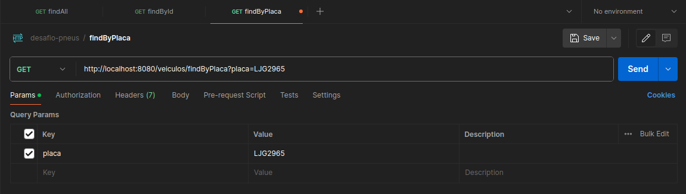
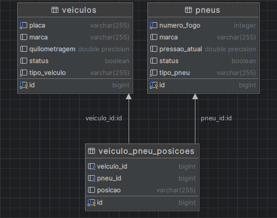
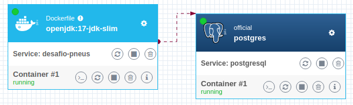

# Desafio Técnico | Back-end | Java

<h3>

</h3>

API em Java 17 com spring-boot 3.3.2 
Base de dados PostgreSQL 13
 

## Executando em ambiente local com Docker 🐋
A partir da pasta raiz do projeto, onde se encontra o arquivo docker-compose.yml, execute o comando para iniciar o container:
> docker-compose up --build
>

Feito isso, verifique se os containers estão em execução e faça uma requisição na API utilizando Postman, ou outro software de sua preferência:
> localhost:8080/veiculos/findAll
>
> localhost:8080/veiculos/findByPlaca
>
 

### Exemplo de requisição:

  

 

O container postgresql é dependência do container da API, então irá iniciar antes do build, automaticamente.
Senão, utilize o comando abaixo antes de executar o backend novamente:
> docker-compose up -d postgresql
>

 

## Executando em ambiente local com Maven
### Na raiz da pasta do backend, execute:
> mvn install
>
> mvn spring-boot:run 
> 

#### Ou utilize a IDE de sua preferência.

 

# Modelagem de dados

  

# Estrutura dos Containers

  

